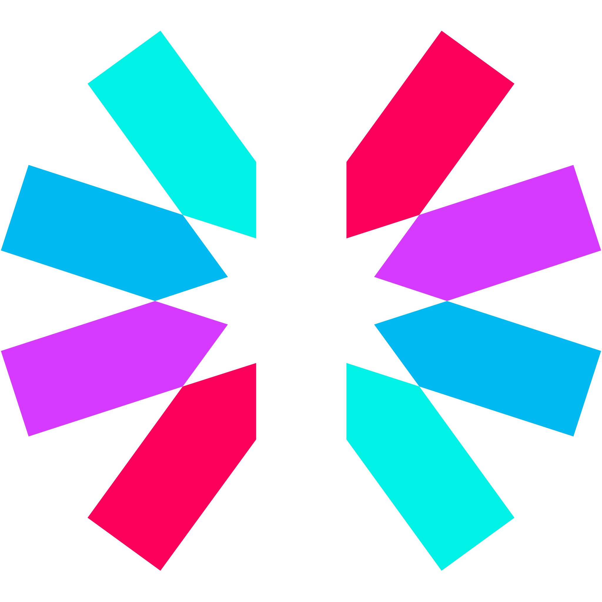

# Hi 👋 !

## I'm Rahul Sarkar

### Frontend Technologies

  
  
  
  
  
  

  
  
  
  
        
<!--    --> 
  
  

### Backend Technologies

  
  
  
  
  

  ### Web.3.0 

  
  
  
  
  

  
### Tools

  
  
  
   

<!-- ## Tech Stacks
- MERN Stack
-->

---

