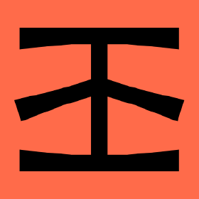

# Hello!  

### I'm Rahul, a web2.0 developer who is diving deep into the world of web3.0

### Frontend Technologies

  
  
    
    
    
  

  
  

  
  
   
    
  
        
<!--    --> 

### Backend Technologies

 

 
  
 
 

  

  ### Web 3.0 

  
  
  
  
  
    
    
    
    
    
  
  
   

  
  ### Deployment & CI/CD

   
    
    
    
   

  
### Tools

  
  
  
   
   
    
    
    
   
    

<!-- ## Tech Stacks
- MERN Stack
-->

---

  
<!--    -->
