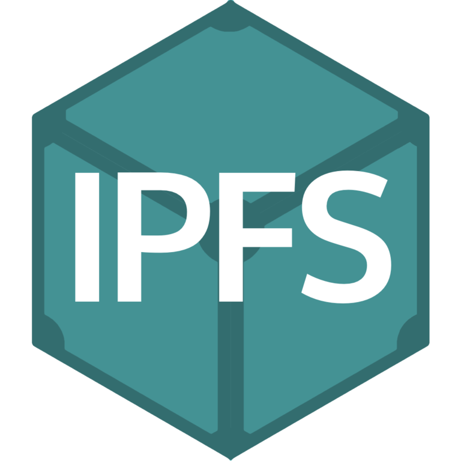

# Hello! 👋 

## I'am Rahul, a web2.0 developer who's diving deep into web3.0

### Frontend Technologies

  
  
    
    
    
  

  
  

  
  
    
  
        
<!--    --> 

### Backend Technologies

  
  
  
    
  
  

  ### Web 3.0 

  
  
  
  
  
    
    
    
    
    
  
  
   

  
### Tools

  
  
  
   
   
    
    

<!-- ## Tech Stacks
- MERN Stack
-->

---

